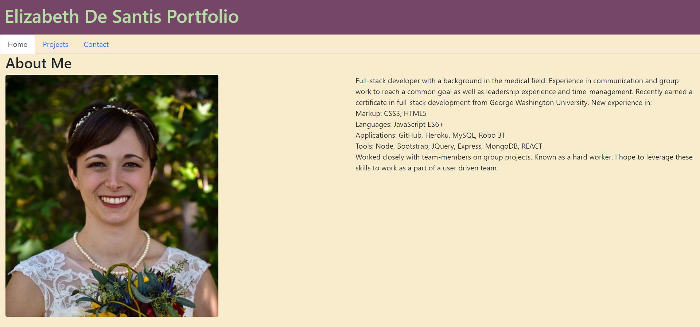

# Readme file generator

## Table of Content
[1 - Description](##Description) 
[2 - Installation Instructions](##Installation-Instructions) 
[3 - Usage](##Usage) 
[4 - Tools](##Tools) 
[5 - Contact](##Contact) 

## Description

Personal portfolio to allow visitors to see completed and in progress projects.  

## Installation Instructions
None installation needed.  Click on link to deploy pages

## Usage

1. Once page is deployed, explore as desired.  
2. 
3. 
4. 

## Tools

This application was developed using REACT.

## Contact

Creator: Elizabeth De Santis
URL: https://desantel.github.io/REACTPortfolio/
